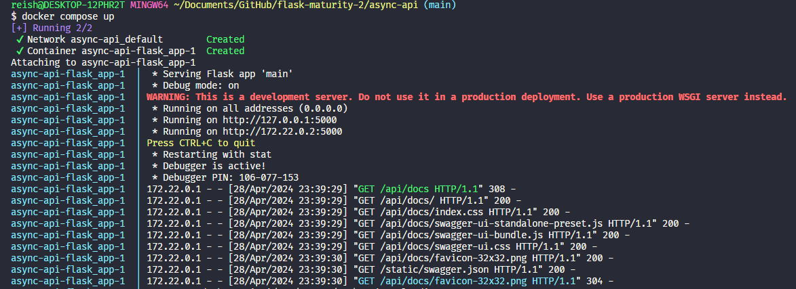

# API Assíncrona

## Introdução

Este projeto é uma API simples desenvolvida como parte de um exercício acadêmico. Implementa uma API RESTful assíncrona usando Flask em Python e inclui autenticação de usuário.

## Requisitos

- Python 3.6+
- Flask
- Flask-JWT-Extended
- Flask-Swagger-UI
- Flask-CORS
- Flask-SQLAlchemy
- SQLite

## Importante
O que faz essa api ser síncrona é o seguinte código do arquivo `app.py`. Mais especificamente a linha `threaded=True`:
```
if __name__ == "__main__":
    app.run(debug=True, threaded=True, host="0.0.0.0")
```


## Configuração e Instalação
### Localmente
1. Instale as dependências:
   ```bash
   pip install -r requirements.txt
   ```

2. Inicialize o banco de dados:
   ```bash
   python3 main.py create_db
   ```

3. Execute a aplicação:
   ```bash
   python3 main.py
   ```

   A aplicação estará disponível em `http://127.0.0.1:5000/`.

### Docker
1. Vá para a root do repositório:
   ```bash
   cd ..
   ```
2. Rode o container docker:
   ```bash
   docker compose up
   ```

A aplicação estará disponível em `http://127.0.0.1:5000/`.


### Screenshot de funcionamento da aplicação



## Pontos de Extremidade da API

- `POST /login`: Autentica usuários e retorna um JWT.
- `GET /user-login`: Página de login.
- `GET /user-register`: Página de registro.
- `GET /content`: Página de conteúdo (requer JWT).
- `GET, POST, PUT, DELETE /users`: Pontos de extremidade para gerenciamento de usuários.
  - `GET /users`: Lista todos os usuários.
  - `POST /users`: Cria um novo usuário.
  - `GET /users/{id}`: Obtém um usuário específico.
  - `PUT /users/{id}`: Atualiza um usuário específico.
  - `DELETE /users/{id}`: Deleta um usuário específico.
- `GET, POST, PUT, DELETE /tasks`: Pontos de extremidade para gerenciamento de tasks.
  - `GET /tasks`: Lista todos os tasks.
  - `POST /tasks`: Cria um novo task.
  - `GET /tasks/{id}`: Obtém um task específico.
  - `PUT /tasks/{id}`: Atualiza um task específico.
  - `DELETE /tasks/{id}`: Deleta um task específico.


## Estrutura do Projeto

- `app.py`: O arquivo principal da aplicação Flask.
- `database/`: Configuração do banco de dados e modelos.
- `templates/`: Modelos HTML para a interface do usuário.

## Informações Adicionais

- Os arquivos YAML do Insomnia e os arquivos JSON/YAML do Swagger estão localizados dentro da pasta `static`.

## Request example


Você pode utilizar o arquivo `static/Insomnia.json` para importar as requisições no Insomnia e testá-las.